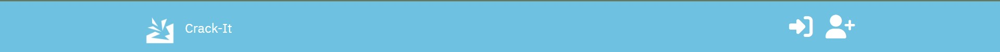

# Crack-it
‘Crack-it’ is a task management app. Designed to be as simple and easy to use as possible to make organising projects quick, easy, and fool-proof. The application consists of an API and a front-end React.js application. This is the documentation for the front-end React app.

## Design

The wireframes for this project can be found here: [the figma file for this project](https://www.figma.com/file/Xy7IknEYiA9DK80qsBmh1f/Task-Manager?type=design&node-id=0-1&mode=design&t=m6P73NpDVyaUjUIy-0)

## Design documents:

Site Goals:

* The app will be clear and easy to use, even for people with little web experience
* The app will be responsive and informative to make processes clear and available to the user at all stages

## User Stories feature mapping:

<table>
  <tr>
   <td>Category
   </td>
   <td>As a 
   </td>
   <td>I want to
   </td>
   <td>So that I can
   </td>
   <td>Mapping API feature
   </td>
  </tr>
  <tr>
   <td>Auth 
   </td>
   <td>user
   </td>
   <td>be able to create a profile to share my work with other users and to 
   </td>
   <td>ensure that I'm allowing access to the right people
   </td>
   <td>Dj-rest-auth

Profile creation (signals)
   </td>
  </tr>
  <tr>
   <td>
   </td>
   <td>
   </td>
   <td>
   </td>
   <td>
   </td>
   <td>
   </td>
  </tr>
  <tr>
   <td>projects
   </td>
   <td>User 
   </td>
   <td>be able to organise similar tasks into projects as a way of breaking up jobs into smaller tasks
   </td>
   <td>Remain focused 
   </td>
   <td>Create projects,  

Edit projects
   </td>
  </tr>
  <tr>
   <td>tasks
   </td>
   <td>user
   </td>
   <td>be able to set tasks as important
   </td>
   <td>to better allocate resources when working on a project
   </td>
   <td>Edit tasks, 

Create tasks
   </td>
  </tr>
  <tr>
   <td>Responsive design
   </td>
   <td>user 
   </td>
   <td>use a website with simple UI that clearly tells me when error has occurred or any other processes
   </td>
   <td>I can understand what is happening with the website and seek help if necessarily
   </td>
   <td>Error mapping,

Bootstrap alerts,
   </td>
  </tr>
  <tr>
   <td>Tasks
   </td>
   <td>user 
   </td>
   <td>be able to create tasks 
   </td>
   <td>break projects down into smaller milestones and have a clear view of my progress within a project
   </td>
   <td>Task create form,

Linked from project create form
   </td>
  </tr>
  <tr>
   <td>Projects
   </td>
   <td>user
   </td>
   <td>create projects 
   </td>
   <td> organise tasks by similar themes and goals, into a clean organised user interface
   </td>
   <td>Project create form,

Project detail vew
   </td>
  </tr>
  <tr>
   <td>Projects
   </td>
   <td>user
   </td>
   <td>be able to see my tasks from the moment I log in
   </td>
   <td>can quickly and easily see which projects I am working on and when they are due in
   </td>
   <td>Index view, 

Task Component, 

Project calendar component,

Project component
   </td>
  </tr>
  <tr>
   <td>Tasks
   </td>
   <td>Project Manager
   </td>
   <td>assign specific tasks to other users working on the same project as me
   </td>
   <td>help with organisation and task delegation
   </td>
   <td>Project Detail view,

Task detail view
   </td>
  </tr>
</table>

## Features

### Nav bar - Logged out 

- The navbar, when logged out displays the logo and title, which both work as links to take the user back to the home page
- The Navbar also features the log in and sign up buttons - which direct users to either log in or sign up, depending on theiraccount status

### Nav bar - logged in 

- The logged in navbar also has the logos and title, along with another logo to show users that they are logged in even when the navbar is not fully extended
- Replacing the logged in icon is the user's profile picture which also demonstrates that they are logged in
- The logged out logo replaces the signup icon and allows users to log out when needed

### Nav bar - Collapsed

- When the navbar is collapsed, the icons move underneath the main bar, and the bar may be collapsed further to keep the screen clear

### Sign up page 

- The sign up page features fields for the user to create an account through
- If the data is enetered incorrectly, the are given warnings and asked to resubmit

### Log In page

- The log in page allows users to input valid log in data to login and access their account 
- Similar to the sign up page, if the data is incorrect and the server returns a 400 error, the user will recieve an error and be asked to resubmit

## Features that will not be implemented 
- While the backend feature has the ability to support adding users to projects, due to time constraints, the front end app will not have this feature
- The profile model was built out into a full detail view, however 
- 

## Testing:

### Manual Testing:

#### Sign-Up Page : 

<table>
  <tr>
   <td>Feature
   </td>
   <td>Expected result
   </td>
   <td>Result 
   </td>
   <td>Pass/fail
   </td>
  </tr>
  <tr>
   <td>Error mapping
   </td>
   <td>When Incorrect or null data is entered the form returns errors for each field that is not correctly filled in.
   </td>
   <td>Incorrectly filled in fields return errors
   </td>
   <td>Pass
   </td>
  </tr>
  <tr>
   <td>Submit form button
   </td>
   <td>When correct data is entered, the user is created and the user is redirected to the login page 
   </td>
   <td>Correctly entered signup data creates a user and redirects them to the login page
   </td>
   <td>Pass
   </td>
  </tr>
  <tr>
   <td>Log in link
   </td>
   <td>When a user clicks on the link at the bottom of the sign-in page, they are redirected to the login page
   </td>
   <td>When the link is clicked, the user is redirected to the login page
   </td>
   <td>Pass
   </td>
  </tr>
</table>

#### Login Page: 

<table>
  <tr>
   <td>Feature
   </td>
   <td>Expected result
   </td>
   <td>Result 
   </td>
   <td>Pass/fail
   </td>
  </tr>
  <tr>
   <td>Error mapping
   </td>
   <td>When Incorrect or null data is entered the form returns errors for each field that is not correctly filled in.
   </td>
   <td>Incorrectly filled in fields return errors
   </td>
   <td>Pass
   </td>
  </tr>
  <tr>
   <td>Submit form button
   </td>
   <td>When correct data is entered, the user is logged in and then redirected to the home page 
   </td>
   <td>Correctly entered and submitted login data logs in the user and redirects them to the home page
   </td>
   <td>Pass
   </td>
  </tr>
  <tr>
   <td>Sign-up link
   </td>
   <td>When a user clicks on the link at the bottom of the login page, they are redirected to the sign-up page
   </td>
   <td>When the link is clicked, the user is redirected to the sign-up page
   </td>
   <td>Pass
   </td>
  </tr>
</table>

#### Navbar component:

<table>
  <tr>
   <td>Feature
   </td>
   <td>Expected result
   </td>
   <td>Result 
   </td>
   <td>Pass/fail
   </td>
  </tr>
  <tr>
   <td>Navbar expand
   </td>
   <td>When the app is in tablet or mobile mode, the navbar expands when the hamburger symbol is click, and retracts when clicked again
   </td>
   <td>The navbar expands and contracts when the appropriate actions are taken
   </td>
   <td>Pass
   </td>
  </tr>
  <tr>
   <td>Icon/Home page link 
   </td>
   <td>When the logo is clicked, users are taken to the index page, wherever they started from
   </td>
   <td>When clicked, the users are taken to the home page
   </td>
   <td>Pass
   </td>
  </tr>
  <tr>
   <td colspan="4" >Logged out users
   </td>
  </tr>
  <tr>
   <td>Sign up link
   </td>
   <td>When the users click the link, they are directed to the sign-up page 
   </td>
   <td>On click, the user is directed to the sign-up page
   </td>
   <td>Pass
   </td>
  </tr>
  <tr>
   <td>Sign in link
   </td>
   <td>When the user clicks on the sign in link, they are taken to the sign in page
   </td>
   <td>On click, the user is directed to the sign-in page
   </td>
   <td>Pass
   </td>
  </tr>
  <tr>
   <td colspan="4" >Logged in users
   </td>
  </tr>
  <tr>
   <td>Avatar
   </td>
   <td>When a user logs in, their profile picture is displayed on the navbar to let them know they’re logged in 
   </td>
   <td>When logged in, the user’s profile picture displays on the navbar
   </td>
   <td>pass
   </td>
  </tr>
  <tr>
   <td>Profile detail link
   </td>
   <td>When the user’s avatar is clicked in the navbar, they are taken to the user’s profile detail view
   </td>
   <td>When the avatar is clicked, the user is taken to the correct profile detail page
   </td>
   <td>Pass
   </td>
  </tr>
  <tr>
   <td>Sign out link
   </td>
   <td>When the user clicks on the sign out link, they are logged out and redirected to the home page, as a logged out user
   </td>
   <td>On click, the user is logged out and sent back to the home page as a logged out user
   </td>
   <td>Pass
   </td>
  </tr>
  <tr>
   <td>Home page link (secondary)
   </td>
   <td>When users are logged in, they have a secondary home page link in order to demonstrate their status. 
   </td>
   <td>
   </td>
   <td>Pass
   </td>
  </tr>
</table>

## Page Component Breakdown:

* Most reused components
    * Navbar
        * Reused on every page - wired directly into App.js
    * Avatar
        * Used in the Navbar and also re-used to provide loaders on different pages that need various load states
    * Task Cards
        * Used to display basic details of a task, reused on the home and project pages

## Sprints

### 1st Milestone:

All three apps created - profile, project and tasks are the main three apps required for my projected and all of them have been initialised. Currently only the models for tasks and profiles are completed. The project model needs more work to link it to users and profiles

All design elements of the project are complete, with wireframes complete for all views, mobile and computer and fonts, colours and logos picked out. The design document for the project has not been started, but as the project has been kept as simple as possible, it should, ideally, be a fairly quick process. 

Errors: so far two major errors have been encountered, and both fixed. They both involved various errors within the project’s databases and migrations. As such they were both easily solved by resetting the databases.

Views for the Task and Profile model have both been started, with the Task model having a List Create Edit and Delete view. The profile model so far only has the List view, and the create view works in tandem with the process of creating a user, so an external one is not necessary. 

The serializers for the Task and Profile model are also completed. 

The priorities for the next sprint are:

* Finish the Project model, serializer and views
* Write the tests for all models
* Sort the remaining user stories by how important they are to the project/urgency and which to focus on next 

### 2nd Milestone :

Major issues with the relationships between the task/project/user models fixed. While in development, the task model was not linked to the project model, and so tasks could be created when not linked to a project. This occurred, because the task model was developed before the project model and the many-to-many relationship was kept commented out for the time being. 

For all three models, manual preliminary tests for creation, updates, retrieval, and deletion are passing, more in-depth user story testing has not yet occurred. Automatic testing has hit 94% coverage according to html-cov through pytest. All of those tests are passing. 

The repository and user stories for the front-end of the project have been created. The user stories will be added to the project board and have tasks assigned to them at the beginning of the next sprint. 

Priorities for the next sprint:

* Front end app MVP
* Manual Testing for User stories (Both Front and Back end)
* Attempt automated testing for Front end

### 3rd Milestone

The final sprint is the shortest, only constituting 2 weeks. This sprint constituted all of the frontend development for the app. Unfortunately this time constraint and my lack of knowledge with React has led to many difficulties. 

The initial development was slow and constituted of the main basic features of the site - developing the navbar and avatar components for the site. The next functionality to be developed were the project and task creation forms. These forms take data from the users and send it to the API. From there, the detail pages for each model were built, allowing users to instantly see what they had just created. 

Unfortunately due to time constraints, not all intended features could be implemented and many bugs still remain in the code, that will not be fixed.  

## Credits: -

LOGO - [https://game-icons.net/1x1/lorc/edge-crack.html](https://game-icons.net/1x1/lorc/edge-crack.html)

Favicon creator [https://realfavicongenerator.net/](https://realfavicongenerator.net/)

React calendar: [https://github.com/wojtekmaj/react-calendar](https://github.com/wojtekmaj/react-calendar) 

Spinner loader gif: [https://loading.io/spinner/spinner/](https://loading.io/spinner/spinner/)

Delete pop-up : [https://stackoverflow.com/questions/67045902/how-to-create-a-confirmation-delete-popup-in-react](https://stackoverflow.com/questions/67045902/how-to-create-a-confirmation-delete-popup-in-react)

Icons: [Font Awesome](https://fontawesome.com/)
